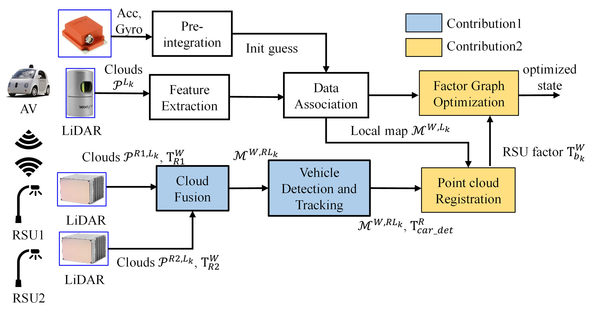

# RSU-aided_LIO

This repo will contain the data for our paper: **Roadside Infrastructure assisted LiDAR/Inertial-based Mapping for Intelligent Vehicles in Urban Areas**

  

## Videos:
Checkout our demo at [Video Link](https://youtu.be/qan46m3gczo)

