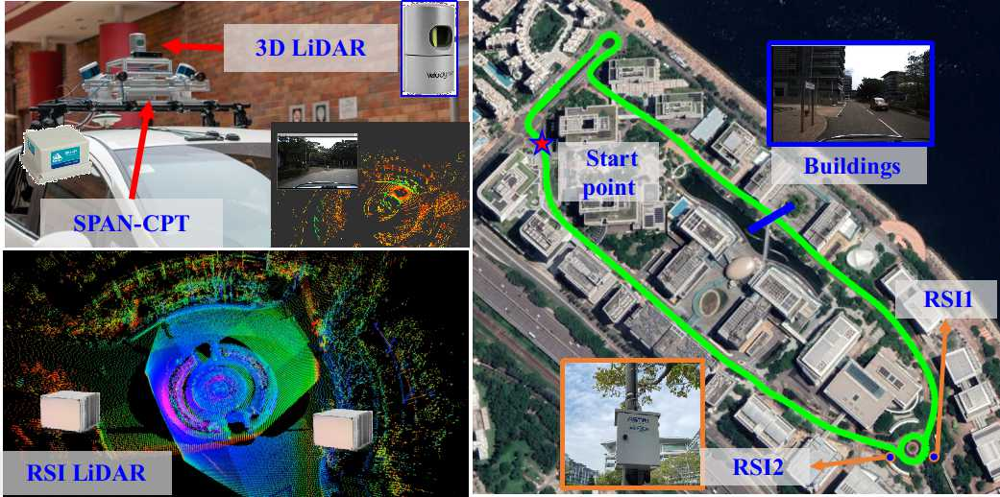

# RSI-aided LiDAR/Inertial Odometry and Mapping

This repo contains the data of  our ITSC 2023 [paper](doc/ITSC2023_RSI_aided_mapping.pdf): **Roadside Infrastructure assisted LiDAR/Inertial-based Mapping for Intelligent Vehicles in Urban Areas** . It is part of the project [V2X Cooperative Navigation](https://sites.google.com/view/v2x-cooperative-navigation).

<p align="center">
  
</p>

## Videos:
Checkout our demo at [Video Link](https://youtu.be/qan46m3gczo)
<p align='center'>
<a href="https://youtu.be/qan46m3gczo">

</a>
</p>

## Sensor Setup
<p align="center">
  
</p>

### Vehicle Platform
We use the [UrbanNav](https://github.com/IPNL-POLYU/UrbanNavDataset/tree/master) vehicle platform to conduct the experiments. GNSS, INS, cameras, and LiDARs are equipped on the vehicle platform. In addition, NovAtel SPAN-CPT integrates a fiber optics gyroscope (FOG) and GNSS-RTK to provide the ground truth (GT) positioning. Furthermore, the measurements from SPAN-CPT are further tightly coupled using the NovAtel Inertial Explorer to maximize the accuracy of the GT. 

### V2X Platform with intelligent sensors
Each Roadside Infrastructure (RSI) in the ASTRI's [Hong Kong testbed](https://www.astri.org/tdprojects/connected-vehicle-v2x-technology/) contains measurements from GNSS, 300-line LiDAR, high-performance V2X communication, and edge computing.

### Synchronization
PPS time synchronization with the GPS source is performed on our vehicle platform while PTP time synchronization with the GPS source is conducted on the RSI side.

## Dataset Details
The dataset is released as rosbag and the vehicle data is available publicly. The RSI data we are applying permission for open-source. The RSI data only available upon request and got approved by ASTRI team currently. You can contact ASTRI's Kevin via email <kevinchen@astri.org> and cc me <darren-f.huang@connect.polyu.hk>. We will reply you in as soon as possible.

| name | duration | size | link | 
| :--: | :------: | :--: | :--: |
| vehicle_data_0412 | 484s | 3.6 GB | [ROSBAG](https://www.dropbox.com/s/n6bg824ei0le918/vehicle_data_0412.bag?dl=0), [GT](https://www.dropbox.com/s/vvsca61as1kucy2/20230412_gt.txt?dl=0)|

The topics within the rosbag are listed below:
| topic | type | frequency | description |
| :---: | :--: | :-------: | :---------: |
| /velodyne_points | sensor_msgs/PointCloud2 | 10Hz | Velodyne_HDL32 |
| /imu/data | sensor_msgs/Imu | 400Hz | IMU |
| /novatel_data/inspvax | novatel_msgs/INSPVAX | 100Hz | Ground truth |

## Tools 
You can visualize the Ground truth or transform it into ENU or LiDAR local frame using the tools in [here](https://github.com/IPNL-POLYU/UrbanNavDataset/tree/master/tools/gt_vis)


## Acknowledge
The authors would like to express their thanks to Hoi-Fung Ng, Xikun Liu, and Yihan Zhong from [IPNL lab](https://www.polyu.edu.hk/aae/ipn-lab/us/index.html) for their kind help in the data collection. And the authors also thank the valuable comments from ITSC 2023 reviewer, we will try our best to extend our work with more scenarios and integrate with selected GNSS in the future. 

## Citation
If you use this work for your research, you may want to cite
```
@INPROCEEDINGS{rsalio2023huang,
  author={Huang, Feng and Chen, Hang and Urtay, Alpamys and Su, Dongzhe and Wen, Weisong and Hsu, Li-Ta},
  booktitle={2023 IEEE 26th International Conference on Intelligent Transportation Systems (ITSC)}, 
  title={Roadside Infrastructure assisted LiDAR/Inertial-based Mapping for Intelligent Vehicles in Urban Areas}, 
  year={2023},
  volume={},
  number={}
}
```
