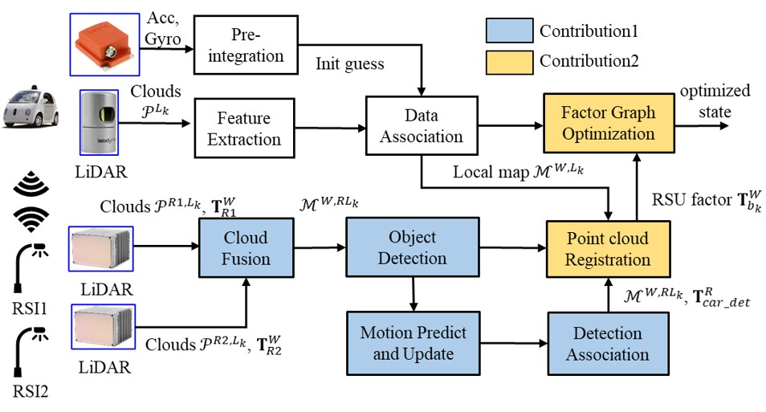

# RSI-aided LiDAR/Inertial Odometry and Mapping

This repo will contain the data for our paper: **Roadside Infrastructure assisted LiDAR/Inertial-based Mapping for Intelligent Vehicles in Urban Areas**. It is part of the project [V2X Cooperative Navigation](https://sites.google.com/view/v2x-cooperative-navigation).

  

## Videos:
Checkout our demo at [Video Link](https://youtu.be/qan46m3gczo)

